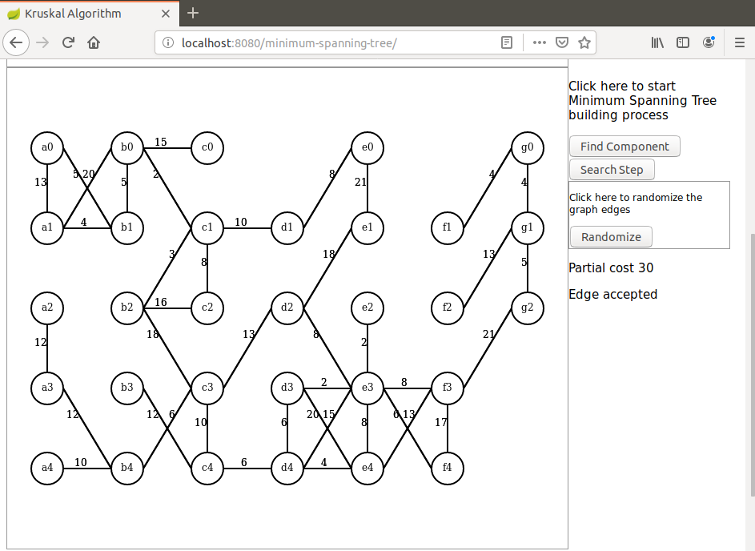

# kruskal-step

I present here a Java based demonstration of the Kruskal minimum spanning tree algorithm. 

The algorithm itself is implemented in Java, Javascript is only used for initialization and display on Canvas.

Only a recent Maven version is required to run this demo.

First an undirected graph is randomly created and its largest connected component is extracted (Java side).

Then a minimum spanning tree is build stepwise (Java side) and the graph is redrawn on each step (browser side).

To launch the demo run this command in project directory: `mvn spring-boot:run`.

When the application has started hit the browser on URL `localhost:8080/minimum-spanning-tree`.

Here are some screenshots that can be seen during this demo.

After the graph was initialized:

After the largest component was computed:

Single step:

For an animated demonstration of Kruskal algorithm please visit this repository:

https://github.com/dubersfeld/kruskal-anim

Dominique Ubersfeld, Cachan, France
